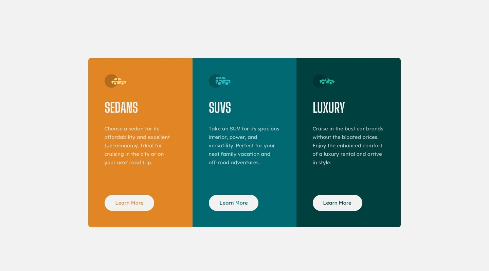

# Frontend Mentor: 3-column-preview-card
This is a solution to the [3-column preview card component challenge on Frontend Mentor](https://www.frontendmentor.io/challenges/3column-preview-card-component-pH92eAR2-).
### The challenge
The challenge is to build out the 3-column preview card component and get looking as close to the design as possible.

Your users should be able to:
- View the optimal layout depending on their device's screen size
- See hover states for interactive elements
### Built with
- Semantic HTML5 markup
- CSS custom properties
- Flexbox
- CSS Grid
### Links
- Solution URL: https://github.com/jomoke814/column-preview-card.
- Live Site URL: https://jomoke814.github.io/column-preview-card/

### Desired outcome screenshots
Desktop and Mobile designs:

